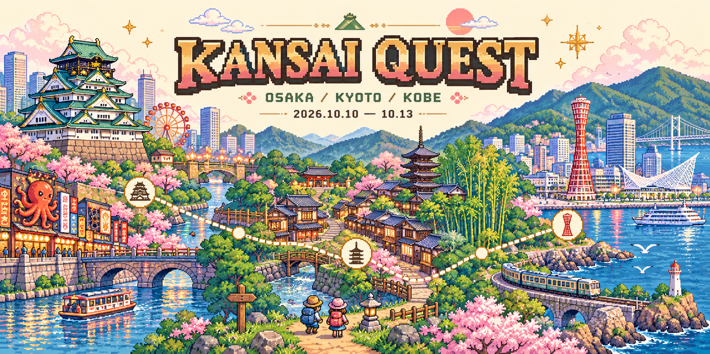

# Kansai Quest 2026



2026년 10월 10일~13일 오사카·교토·고베 여행을 위한 **레트로 RPG 스타일 모바일 여행 PWA**입니다.
빌드 도구 없이 정적 파일(`dist/`)만으로 동작하며, 아이폰 홈 화면에 추가해 앱처럼 쓸 수 있습니다.

## 주요 기능

| 탭 | 내용 |
|----|------|
| 준비물 | 항목 추가·삭제·체크, 기기에 자동 저장 |
| 오늘 | 오늘 날짜의 일정과 다음 할 일 |
| 일정 | 도시를 선택하면 해당 날짜의 세부 일정 표시 |
| 티켓 | HARUKA·우메다 스카이빌딩 티켓 이미지 등록·열기·삭제 |
| 먹거리 | 음식 30종 체크리스트, 픽셀 아트 일러스트와 실제 음식 사진 |

- **일정 관리**: 완료 체크, 계획 시각 변경, 날짜별 메모
- **길찾기**: 각 일정에서 Google Maps 길찾기, 숙소 복귀 버튼
- **날씨**: [Open-Meteo](https://open-meteo.com/) 기반 도시별 날씨 (일정에 따라 오사카 → 교토 → 고베 자동 전환)
- **오프라인**: 첫 방문 후 서비스 워커가 화면과 음식 사진을 캐시 (지도·날씨는 인터넷 필요)

## 실행

```bash
python3 -m http.server 8080 --directory dist
```

브라우저에서 `http://localhost:8080`을 엽니다.

## 배포

`dist/` 디렉터리를 정적 호스팅(GitHub Pages, Vercel 등)에 올리면 됩니다.
서비스 워커는 HTTPS에서만 동작합니다. 아이폰 Safari 공유 메뉴 → **홈 화면에 추가**로 설치합니다.

## 데이터 저장

모든 데이터는 사용 중인 기기 브라우저에만 저장되며 서버로 전송되지 않습니다.

- 일정 완료·시각·메모, 준비물, 먹거리 체크: `localStorage`
- 티켓 이미지: `IndexedDB` (기기별 저장 — 다른 기기와 공유되지 않음)

## 프로젝트 구조

```
dist/
├── index.html        # 앱 화면
├── app.js            # 일정·탭·티켓·체크리스트 로직
├── weather.js        # Open-Meteo 날씨
├── food-art.js       # 음식 픽셀 아트 SVG
├── food-photos.js    # 음식 사진 데이터
├── style.css
├── sw.js             # 오프라인 캐시 서비스 워커
├── manifest.json     # PWA 매니페스트
└── assets/
    ├── world.png     # 픽셀 월드 배너
    └── food-photos/  # 음식 사진 30장 + credits.json
```

## 참고 사항

- 일정 시각은 예시 계획이며 실시간 운행 정보가 아닙니다. 다음 일정은 미완료 항목 순서로 표시됩니다.
- 교통: HARUKA·스카이빌딩 개별권 구매, 주유패스 미구매, 일반 교통은 Suica 결제 기준입니다.
- 출발 전 아리마 버스 예약 여부와 숙소 체크아웃 시간을 확인하세요.
- 티켓 원본 이미지는 직접 등록해야 합니다.

## 이미지 출처

- 음식 사진은 Wikimedia Commons에서 가져왔으며, 각 사진의 저작자·라이선스(CC BY, CC BY-SA, CC0 등)는 앱 내 사진 아래와 `dist/assets/food-photos/credits.json`에 표기되어 있습니다.
- 픽셀 월드 배너(`world.png`)와 README 배너(`docs/banner.png`)는 이미지 생성 AI로 만든 이미지입니다.
